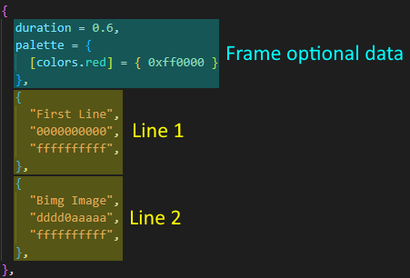

# bimg File Format Specification
bimg (abbreviation of "blit image") is a versatile image format for the ComputerCraft Minecraft mod.
This specification aims to provide a standardized image format that can be easily implemented and used throughout the entire ComputerCraft ecosystem.

# File Structure
The examples shown throughout this specification are based on a sample image file, serialized using `textutils.serialize`.

An image file can be separated into two sections: metadata and frame data:


Metadata contains information about the image itself, while the remaining of the file contains one or more frames, representing the images.

For more information on metadata, see [Metadata](#metadata). For more information on the image data and frames, see [Image Data](#image-data)
.
# Metadata
bimg stores the following metadata along the image data in the file.

| Field | Type | Description |
|:--|:-:|:--|
| `version` | `string` | Format version of the file. Used to differentiate two bimg file formats. Composed of three numbers separated by dots, defining the major, minor, and revision number respectively. |
| `author` | `string` | Author of the image. |
| `title` | `string` | Title of the image. Set by the author.
| `description` | `string` | Description of the image. Set by the author. |
| `creator` | `string` | Software that created the image. |
| `date` | `string` | Date and time the image was created on, in ISO-8601 format. |
| `animation` | `boolean` | Whether the file contains multiple frames and can be interpreted as an [animation](#animations).
| (if animation) `secondsPerFrame` | `number` | Default length of each frame in seconds.
| `palette` | `table` | Color palette table applied to the whole set of frames. For more information on palette formats, see [Palettes](#palettes).

All metadata fields are optional, besides the `version` and `animation` fields. When the `animation` field is set to `true`, the `secondsPerFrame` field becomes required too.

# Image Data
Aside the metadata are stored the frames of the image. At least one frame must be present for the file to be considered valid.
For animation support, see [Animations](#animations).

## Frame Structure
A single frame is composed of multiple numerically-indexed tables, each representing a single line of the image.
Additionally, an optional per-frame palette can be provided to alter the colors of that frame only. For more information on palettes, see [Palettes](#palettes).

When the image is an animation, an optional `duration` field can also be provided. This field overrides the `secondsPerFrame` field set in the metadata, and therefore sets a specific duration for that frame only.



Each line is composed of three `string` values forming a blit table, that can be unpacked directly to `term.blit` when rendering the image. Spaces in the background blit string should be treated as transparent, where transparent pixels should take the already existing background color upon rendering.

## Animations
bimg can support multiple frames per image file. Each frame is numerically indexed at the root of the table, along the metadata. This allows easy retrieval with `ipairs`.

In the event multiple frames are provided, the image is considered as an animation. Consequently, the `animation` boolean should be set to `true`, and the `secondsPerFrame` field should be present.

# Palettes
Palettes allows the modification of the existing 16 ComputerCraft colors available in the `colors` API to custom RGB values, applied to the whole terminal at once.
bimg allows the use of such palettes to render images more realistically, allowing for image effects (like dithering) to be applied.

Palettes are formatted as a table, where the keys corresponds to the ComputerCraft color values, and the values the new RGB colors to apply.
Values are contained themselves in a table, and can be either represented by a triplet of float numbers ranged from 0 to 1, each representing a color component, or a single integer number representing the three components at once:
 - `{ 1, 1, 0 }` sets the red and green components to full, outputting a bright yellow.
 - `{ 0xFFFF00 }` has the same effect, and will also provide a bright yellow.

This allows both versions of `term.setPaletteColor()` to be supported through a single call, by unpacking the color table into the last argument:
```lua
for color, tbl in pairs(palette) do
    term.setPaletteColor(color, table.unpack(tbl))
end
```

Full example of a bimg color palette, featuring both color formats:
```lua
{
    [colors.red] = { 1, 0, 0 },
    [colors.green] = { 0, 1, 0 },
    [colors.blue] = { 0x0000FF },
    [colors.gray] = { 0.5, 0.5, 0.5 }
}
```

If palettes are both defined in the metadata and in a frame, the palette in the frame takes higher precedence over the one defined in the metadata. Colors that are defined in the metadata palette but not in the frame palette are still applied.

In the example below, both colors are modified and applied when rendering the frame:
```lua
-- In metadata
palette = {
    [colors.red] = { 0xFF0000 }
}

-- In frame
palette = {
    [colors.blue] = { 0x0000FF }
}
```